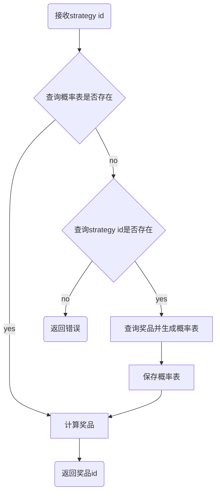

# 设计文档

## 奖品计算（strategy）

### 表设计

```mermaid
erDiagram
    draw_strategy {
        int id pk
        int strategy_id unique
        varchar(255) name
    }

    prize_item {
        int id pk
        int item_id unique
        int strategy_id
        varchar(255) name
        decimal(7, 6) probability
    }

    draw_scheme ||--|{ prize_item
```

### 数据结构

strategy id - 概率表 - 具体奖品

### 算法

### 流程图



#### 哈希表（o(1)）

#### 范围（o(lgn)）

## 奖品扣减（award）
