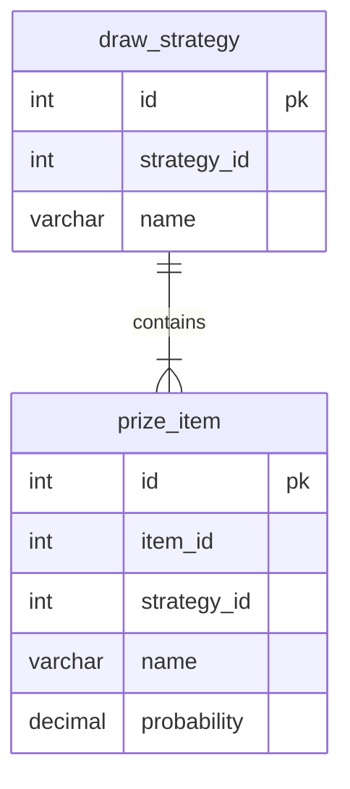
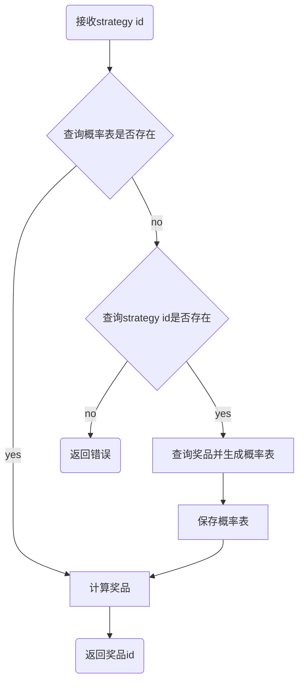
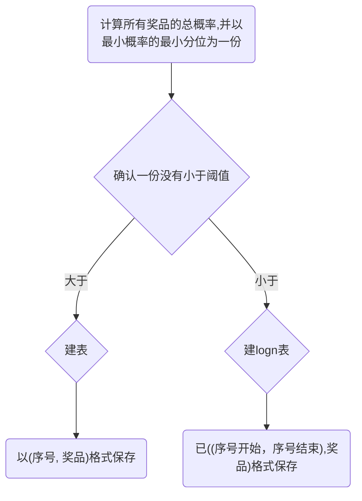

# 设计文档

## 奖品计算（strategy）

### 表设计

```mermaid
erDiagram
    draw_strategy {
        int id pk
        int strategy_id 
        varchar name
    }

    prize_item {
        int id pk
        int item_id 
        int strategy_id
        varchar name
        decimal probability
    }

    draw_strategy ||--|{ prize_item: contains
```

### 数据结构

strategy id - 概率表 - 具体奖品

### 算法

### 流程图

```mermaid
flowchart TD

start(接收strategy id) --> check_table{查询概率表是否存在}
check_table --> |yes| calculate
check_table --> |no| check_id{查询strategy id是否存在}
check_id --> |yes| generate_table[查询奖品并生成概率表]
check_id --> |no| fail(返回错误)
generate_table --> save[保存概率表]
save --> calculate[计算奖品]
calculate --> success(返回奖品id)
```

建表流程

```mermaid
flowchart TD
    start(计算所有奖品的总概率,并以最小概率的最小分位为一份) --> check_range{确认一份没有小于阈值}
    check_range --> |大于| build{建表}
    check_range --> |小于| build_logn{建logn表}
    build --> calculate_save("以(序号, 奖品)格式保存")
    build_logn --> save_logn("已((序号开始，序号结束),奖品)格式保存")
```
#### 哈希表（o(1)）
算法: 随机一个range中的数并从表中get出奖品

#### 范围（o(lgn)）
算法: 随机一个range中的数并用二分算出奖品

## 奖品扣减（award）
